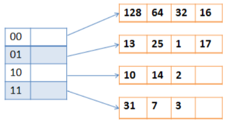
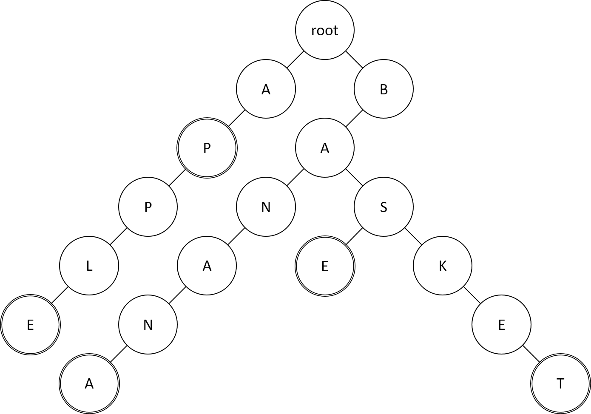

# Data Structure and Algorithm hw3 - b05902086
## Problem 1. Hash (25%)
1. (8%) In class, we have learned hash open addressing. Assume the primary hash function is h1(k) = k mod m, and the secondary hash function is h2(k) = 1 + (k mod (m-1)). Please insert the keys {18, 34, 9, 37, 40, 32, 89} in the given order into a hash table of length m = 11. Draw the procedure to simulate how the keys are inserted into the hash table by using open addressing with double hashing and with linear probing in a step-by-step manner after every insertion.
    * insert 18
        * h1(18) = 18 mod 11 = 7, h2(18) = 1 + (18 mod 10) = 9
        ```
          0  1  2  3  4  5  6  7  8  9 10
        [  ,  ,  ,  ,  ,  ,  ,  ,  ,  ,  ]
                              ^^          // check 7
        insert 18 at 7
          0  1  2  3  4  5  6  7  8  9 10
        [  ,  ,  ,  ,  ,  ,  ,18,  ,  ,  ]
        ```
    * insert 34
        * h1(34) = 34 mod 11 = 1, h2(34) = 1 + (34 mod 10) = 5
        ```
          0  1  2  3  4  5  6  7  8  9 10
        [  ,  ,  ,  ,  ,  ,  ,18,  ,  ,  ]
            ^^                            // check 1
        insert 34 at 1
          0  1  2  3  4  5  6  7  8  9 10
        [  ,34,  ,  ,  ,  ,  ,18,  ,  ,  ]
        ```
    * insert 9
        * h1(9) = 9 mod 11 = 9, h2(9) = 1 + (9 mod 10) = 10
        ```
          0  1  2  3  4  5  6  7  8  9 10
        [  ,34,  ,  ,  ,  ,  ,18,  ,  ,  ]
                                    ^^    // check 9
        insert 9 at 9
          0  1  2  3  4  5  6  7  8  9 10
        [  ,34,  ,  ,  ,  ,  ,18,  , 9,  ]
        ```
    * insert 37
        * h1(37) = 37 mod 11 = 4, h2(37) = 1 + (37 mod 10) = 8
        ```
          0  1  2  3  4  5  6  7  8  9 10
        [  ,34,  ,  ,  ,  ,  ,18,  , 9,  ]
                     ^^                   // check 4
        insert 37 at 4
          0  1  2  3  4  5  6  7  8  9 10
        [  ,34,  ,  ,37,  ,  ,18,  , 9,  ]
        ```
    * insert 40
        * h1(40) = 40 mod 11 = 7, h2(40) = 1 + (40 mod 10) = 1
        ```
          0  1  2  3  4  5  6  7  8  9 10
        [  ,34,  ,  ,37,  ,  ,18,  , 9,  ]
                              ^^          // check 7
          0  1  2  3  4  5  6  7  8  9 10
        [  ,34,  ,  ,37,  ,  ,18,  , 9,  ]
                                 ^^       // check (7 + 1) mod 11 = 8
        insert 40 at 8
          0  1  2  3  4  5  6  7  8  9 10
        [  ,34,  ,  ,37,  ,  ,18,40, 9,  ]
        ```
    * insert 32
        * h1(32) = 32 mod 11 = 10, h2(32) = 1 + (32 mod 10) = 3
        ```
          0  1  2  3  4  5  6  7  8  9 10
        [  ,34,  ,  ,37,  ,  ,18,40, 9,  ]
                                       ^^ // check 10
        insert 32 at 10
          0  1  2  3  4  5  6  7  8  9 10
        [  ,34,  ,  ,37,  ,  ,18,40, 9,32]
        ```
    * insert 89
        * h1(89) = 89 mod 11 = 1, h2(89) = 1 + (89 mod 10) = 10
        ```
          0  1  2  3  4  5  6  7  8  9 10
        [  ,34,  ,  ,37,  ,  ,18,40, 9,32]
            ^^                            // check 1
          0  1  2  3  4  5  6  7  8  9 10
        [  ,34,  ,  ,37,  ,  ,18,40, 9,32]
         ^^                               // check (1 + 10) mod 11 = 0
        insert 89 at 0
          0  1  2  3  4  5  6  7  8  9 10
        [89,34,  ,  ,37,  ,  ,18,40, 9,32]
        ```
2. (6%)
    * (a) (3%) Now we consider dynamic hashing. The figure below is a hash table using dynamic hashing with directory. Each table entry can hold up to 4 keys, and the hash function h(k, n) is defined as the last n bits of binary representation of key k. But TA made some mistakes in drawing the graph. Please help TA fix the problems.
        
    * (b) (3%) After you correct the hash table, please draw a graph to show the content of the hash table after inserting the keys {30, 49, 4} into the table.
        ``` 
        000 ─────> [128, 64, 32, 16]
        001 ─────> [ 25,  1, 17, 49]
        010 ─┬───> [ 10, 14,  2, 30]
        011 ─┼─┬─> [ 31,  7,  3,   ]
        100 ─┼─┼─> [  4,   ,   ,   ]
        101 ─┼─┼─> [ 13,   ,   ,   ]
        110 ─┘ │
        111 ───┘
        ```
3. (5%) TAs want to play a remote version (e.g. by FB messenger texting) of rock-paperscissors, yet TAs are all cunning and not trustworthy. A main problem of the remote version of rock-paper-scissors is someone might throw late (due to message delay). Thus, it’s hard to keep the fairness of the game. We suppose that the connection is secured, please design an algorithm such that at least two TAs can play the remote version of rock-paper-scissors impartially without the third party. The algorithm should guarantee the fairness for any two players, no matter which player throws late. Hint: Use hash function like SHA-256 causing few collisions. What nice properties does this kind of hash function should have?
    * 假設現在 A 和 B 要猜拳，在不失一般性的情況我們讓A出拳，而出拳的方式是 A 把他所出的拳的字串(P,S,R)後面加上一串隨機的"鹽"(一段隨機產生的字串)，並且把鹽記好在自己這裡，然後把這整個字串拿去做 SHA-256 hash，然後把 hash 完的結果傳給另外一個人，而另外一個人這時也用同樣的方法出拳。出完拳之後兩個人再把自己留著的鹽傳給另外一個人檢查，對方只要測試剛剛那個人所送出來的字串是否為正確的拳字元(P,S,R)再加上那段鹽的 hash 就可以知道剛剛出拳的結果，並且驗證。這個方法的好處是再 A 出完拳之後，B 就算看到 A 所傳的字串依然沒有辦法知道 A 所出的拳，而 A 也沒有辦法再看到 B 所出的拳後改答案，因為很難改變自己手上的鹽並跟改所出的拳後讓 hash 後的值一樣(這個跟構造 SHA-256 的碰撞差不多等價)，因此這個算法是公平的。
4. (6%) Cuckoo hashing is a hashing technique which guarantees O(1) worst case lookup time. It use 2 tables T1 and T2 of same size and 2 hash functions h1 and h2. To insert an element x, start by inserting into T1 at position h1(x). If a collision happens, the stored element y is displaced to T2 at position h2(y). In case of another collision, the element currently in T2 at position h2(y) is again evicted and inserted to T1 using h1. Repeat this process, until all elements stabilize. In some cases, the process would never stop. If that happens, perform a rehash by choosing a new h1 and new h2 and inserting all elements back into the tables.
    * (a) (3%) Given 2 tables of size 7 each and 2 hash functions h1(k) = k mod 7 and h2(k) = [k/7] mod 7. Insert elements [6, 31, 2, 41, 30, 45, 44] in the given order. Draw the 2 hash tables after each insertion.
        ```
        T1 = [  ,  ,44,31,  ,  , 6]
        T2 = [ 2,  ,  ,  ,30,41,45]
        ```
    * (b) (3%) Find another element which makes the insertion leads to infinite sequence of displacements. Note that the (h1(k), h2(k)) pair for each element should be unique. Write down the element you insert and all the elements included in this sequence of displacements.
        * 48
        ```
        48 -> 6
        6 -> 2
        2 -> 44
        44 -> 45
        45 -> 31
        31 -> 30
        30 -> 2
        2 -> 6
        6 -> 48
        48 -> 44
        44 -> 30
        30 -> 31
        31 -> 45
        45 -> 48
        48 -> 6
        ......
        ```
## Problem 2. (15%)
Given a sequence of numbers:[3, 5, 2, 6, 7, 8, 1, 10, 4, 9]. Please answer question 1, 2, 3.
1. (3%) Please draw the corresponding Max Heap of numbers shown above and write down the in-order number sequence. (The insertions are performed with the exact order of the sequence.)
    ```
    []
    [ 3]
    [ 5, 3]
    [ 5, 3, 2]
    [ 6, 5, 2, 3]
    [ 7, 6, 2, 3, 5]
    [ 8, 6, 7, 3, 5, 2]
    [ 8, 6, 7, 3, 5, 2, 1]
    [10, 8, 7, 6, 5, 2, 1, 3]
    [10, 8, 7, 6, 5, 2, 1, 3, 4]
    [10, 9, 7, 6, 8, 2, 1, 3, 4, 5]
    ```
2. (3%) Please draw the corresponding Min Heap of numbers shown above and write down the in-order number sequence. (The insertions are performed with the exact order of the sequence.)
    ```
    []
    [ 3]
    [ 3, 5]
    [ 2, 5, 3]
    [ 2, 5, 3, 6]
    [ 2, 5, 3, 6, 7]
    [ 2, 5, 3, 6, 7, 8]
    [ 1, 5, 2, 6, 7, 8, 3]
    [ 1, 5, 2, 6, 7, 8, 3,10]
    [ 1, 4, 2, 5, 7, 8, 3,10, 6]
    [ 1, 4, 2, 5, 7, 8, 3,10, 6, 9]
    ```
3. (3%) Given a query q, please design an algorithm for finding all the elements in the min heap that are smaller or equal to q with time-complexity O(k), where k is the amount of qualified elements. For example, given query q=4, the algorithm outputs [1, 4, 2, 3] and k = 4. Noted that the output could be unsorted. Write down your algorithm in pseudo code and prove that the time-complexity is indeed O(k).
    ```
    void F(int n,int q,int id=0){
        if(id>=n) return;
        if(id<=q) print(min_heap[id]);
        else return;
        F(n,q,id*2+1);
        F(n,q,id*2+2);
        return;
    }
    ```
4. (6%) A binary heap is usually stored in an array for practical reasons. Please propose a method to ”heapify” an array with time complexity O(N), where N is the amount of elements in the heap. Explain how the index conversion implicitly perceives the relation of a node and its children, and prove the time complexity of your method is O(N). (Hint: The position of index 1 stores the root of the heap.)
    ```
    void heapify(array A,int i,int N){
        int now = i , l = 2*i , r = 2*i+1;
        if(l < N && A[l] > A[now])
            now=l;
        if(r < N && A[r] > A[now])
            now=l;
        if(now != i){
            swap(A[i],A[now]);
            heapify(A,now,N)
            }
        }
    void build_heap(array a,int N){
        for(i=N/2;i>=1;i--)
            heapify(a,i,N);
    }
    ```
    * 假設我們heap的高度為(h=log(N))我們會發現第一層有 2^0 個點，對這個點heapify花了(2^0)\*h的複雜度，第二層有2^1個點，對這些點heapify了總共(2^1)\*(h-1)...次。
    * 然後我們把這些東西加起來 = (2^0)\*h+(2^1)\*(h-1)+(2^2)\*(h-2)+(2^3)\*(h-3)... = (2^h) \* ( h/(2^h) + (h-1)/(2^(h-1)) + (h-2)/(2^(h-2)) ...) = (2^h) \* Const(converges) = O(N)
    * 因此我們會發現 build_heap 的複雜度是 O(N) 的
## Problem 3. Trie Trie See (20%)
1. (5%) Please draw a trie that generates the following words. Use double circles to represent end-of-word nodes in the trie. <br />
    
2. (5%) Assume all the alphabet are lower case letters(a-z). Prove that the following trie operations can be done with the time complexity O(N), where N is the length of word:
    ```
    void insert (char word [] , int N ); // insert word into the trie
    void delete (char word [] , int N ); // delete word from the trie
    int query (char word [] , int N ); // check if word is in the trie
    ```
    The structure of a trie node is defined below:
    ```
    struct Node {
        struct Node * children [26];
        int is_word ; // Change to 1 for insert(), 0 for delete()
        int tag ; // may be useful for prob 3 & 4
    };
    ```
    * 在 insert 函數中，我們每次都可以 O(1) 的找到單前字元在目前節點所在的 children 上位置，如果當所指到的 children 為 NULL 的時候就會需要 new 出一個新的節點，這時候會花掉O(26)=O(1)的時間，因此我們可以發現 insert 一個字元所花的時間是 O(1) 因此我們總共只要 O(1)*N = O(N) 的時間複雜度就能完成 insert。
    * 在 delete 函數中，我們每次都可以 O(1) 的找到單前字元在目前節點所在的 children 上位置，而當我們找到字串結尾的時候只需要 O(1) 的時間就能把 is_word 改成 0，因此我們可以發現 delete 一個字元所花的時間是 O(1) 因此我們總共只要 O(1)*N = O(N) 的時間複雜度就能完成 delete。
    * 在 query 函數中，我們每次都可以 O(1) 的找到單前字元在目前節點所在的 children 上位置，而當我們找到字串結尾的時候只需要 O(1) 的時間就能知道 is_word 是否為 1，因此我們可以發現 query 一個字元所花的時間是 O(1) 因此我們總共只要 O(1)*N = O(N) 的時間複雜度就能完成 query。
3. (5%) Given a group of N non-empty words Wi where 1 ≤ i ≤ N and Q queries “S is a prefix of how many words” or “S is a suffix of how many words”, where S is a (possibly different) string in each query. Please give an algorithm to preprocess the N strings in O(sigma(i=1~N) |Wi|) time and answer each query respectively in O(|S|) time. Note that you can not store all the queries and answer them in O(Q|S|) time. Hint: you can construct multiple tries.
    * 我們首先先建兩個 trie，一個 trie 是把字串正常的放進去，另外一個則是把輸入的字串反過來在放進去(然後把字串(Wi)反過來所需的時間複雜度顯然是 O(|Wi|))，然後當我們把兩個 trie 都建好之後在經過下面的這個預處理。
    ```
    int pre_process(struct Node * now){
        now->tag=now->is_word;
        for(int i=0;i<26;i++)
            if(now->children[i])
                now->tag+=pre_process(now->children[i]);
        return now->tag;
    }
    ```
    * 經過這個預處理之後，每個節點的 tag 都會記錄子樹中有多少個單字，然後當詢問S是多少單字的前綴時只要查照正常字串順序建的 trie 中所對應到的節點上的 tag 就是答案，如果是問後綴的話就查詢另外一棵照反轉字串所建的 trie 去查詢。
    * 而這個的時間複雜度證明就是，建立 trie 的時間複雜度是所有字串的總長度，也就是 O(sigma(i=1~N) |Wi|)，並且我們會發現每的節點都最多只會被 pre_process 一次，因此預處理的複雜度最多就是 trie 的節點數，而 trie 的節點數又小於 字元種數(sigma(i=1~N) |Wi|)，因此我們可以在 O(sigma(i=1~N) |Wi|) 的時間完成預處理。而查詢所花的時間複雜度也就是每次詢問的字串長度，也就是 O(|S|)
4. (5%) We introduce the prefix game. First, a list of N non-empty words are given. During the game, two players build a word together, which is initially empty. The players move in turns. In each turn, the player add a single letter at the end of the word, and the resulting word must be the prefix of at least one word from the list. A player loses if he cannot move anymore in his/her turn. We want to find out whether any player has a winning strategy. (That means he/she can always win no matter how the other player moves). Please give an algorithm to determine whether the first player, the second player, or neither of them has a winning strategy.
    ```
    int pre_process(struct Node * now){
        now->tag=0;
        for(int i=0;i<26;i++)
            if(now->children[i])
                now->tag|=!pre_process(now->children[i]);
        return now->tag;
    }
    ```
    * 我們先把那 N 個 non-empty words 建成一個 trie 之後，然後在經過上面的這個 pre_process(root)。最後如果 root 的 tag 是 0 就代表先手必輸，否則就是先手必勝。
