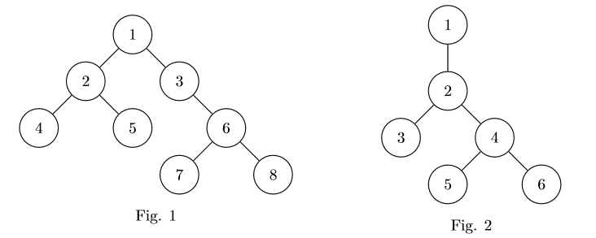
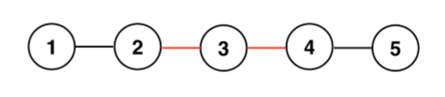
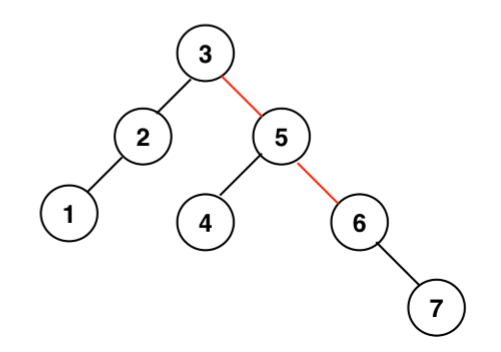

# Data Structure and Algorithm hw4 - b05902086
## Problem 1. More on trees (20%)
1. Centroid (7%).  
    We define the weight of a tree to be the number of nodes in the tree. For example, the weight of the tree in Fig.1 is 8 and the weight of the tree in Fig.2 is 6. The weights of subtrees rooted at 1, 2, 3 in Fig.1 are 8, 3, 4, respectively.  
    If we delete a node in a tree, the tree will split into a forest. For any such forest, we call the largest weight of all trees to be the maximum tree weight of this forest. A tree node is called the centroid if its deletion results in a forest with the smallest maximum tree weight. For example, the centroids of the tree in Fig.1 are node 1 and 3. (The maximum tree weight after deleting either of them is 4.) Note that there can be multiple centroids in a tree.  
      
    To find a centroid, you can arbitrarily pick a node as the root of the tree. Then DFS can be applied to determine the weights of all possible subtrees (with each node as the root of the subtree).  
    * (a) (3%) Give an algorithm to calculate all subtrees’ weights in O(N)-time, where N is the number of nodes in the tree. Please give a pseudo code with simple explanation. For example, in Fig.1, the results of subtree weight at node 1,2,...,8 are 8, 3, 4, 1, 1, 3, 1 and 1 respectively.  
    ```
    Graph G;
    weight[N+1];
    Func build_weight(now=1,parent=0)
        weight[now]=0
        for(next:G[now])
            if(next==parent)
                continue
            calc(next,now)
            weight[now]+=weight[next]
    Func a()
        build_weight()
        print(weight)
    ```
    * (b) (4%) Based on the solution in (a), please give an algorithm for finding one centroid for a given tree in O(N) time.  
    ```
    Func centroid(now=1,parent=0)
        dis1=N-weight[now]
        dis2=0
        candidate=0
        for(next:G[now])
            if(next==parent)
                continue
            if(weight[next]>dis1)
                dis1=weight[next]
                candidate=next
            else if(weight[next]>dis2)
                dis2=weight[next]
        if(dis2+1>=dis1)
            return now
        return centroid(candidate,now)
    Func b()
        build_weight()
        print(centroid())
    ```
2. Diameter (7%)
    This problem is about the diameter of a tree. A diameter path is any of the longest paths in the tree, and the diameter is the length (number of nodes - 1) of the diameter path. For example, the diameters of the trees in Fig.1 and Fig.2 are 5 and 3 respectively. Note that there can be multiple diameter paths in a tree, but only one diameter value.  
    To find the diameter, you can arbitrarily pick a node as the root of the tree. Subsequently, use DFS to determine the heights of all possible subtrees (with each node as the root of the subtree). The height of a tree is the maximum distance from root to a leaf.  
    * (a) (3%) Calculate every subtree’s height in O(N) time, and give the pseudo code with simple explanation. For example, in Fig.1, the results of subtree heights at node 1,2,...,8 are 4, 2, 3, 1, 1, 2, 1 and 1 respectively.
    ```
    Graph G;
    height[N+1];
    Func build_height(now=1,parent=0)
        height[now]=1
        for(next:G[now])
            if(next==parent)
                continue
            calc(next,now)
            height[now]=max(height[now],height[next]+1)
    Func a()
        build_height()
        print(height)
    ```
    * (b) (4%) Using the solution in (a), give an algorithm for finding the diameter of a given tree. Any solution similar to the algorithm in the following subproblem 1.3 is not allowed.
    ```
    Func diameter(now=1,parent=0,dis1=0)
        dis2=0
        candidate=0
        for(next:G[now])
            if(next==parent)
                continue
            if(height[next]>dis1)
                dis1=height[next]
                candidate=next
            else if(height[next]>dis2)
                dis2=height[next]
        if(dis2+1>=dis1)
            return dis2+dis1
        return diameter(candidate,now,dis2+1)
    Func b()
        build_height()
        print(diameter())
    ```
3. Midpoint (6%)
    A midpoint of a tree is the node which has the smallest maximum distance to any other nodes in that tree. Note that there can be multiple midpoints in a tree. You can show that any midpoint is in the middle of some diameter path. (Specifcally, if the diameter path contains an even number of nodes, then both of the middle two nodes are midpoints)  
    To find midpoints easily, we introduce an alternative algorithm for finding a diameter path of a given tree. Please read the pseudo code below.  
    * (a) (3%) In the function solve(), we picked the node 1 to be the root. Show that if we arbitrarily pick a node as the root, the farthest node from the root is always on a diameter path.
        * 假設起點(u)在我們的直徑(s-t)上，那麼最遠點(v)也顯然會在直徑上，因為對於直徑上的任何一個點由其最長的子樹和次長的子樹上的經過此點的最長鍊所接起來得到的長度都會等於直徑，而最遠點也由此發現顯然在直徑上，且一定是s或是t其中的一個點。
        * 假設起點(u)在我們的直徑(s-t)上，如果從u走到了s-t路徑上的一點(X)，那麼接下來的路徑都肯定會在直徑上，且終點為s或t(由前一段得知)。
        * 假設起點(u)在我們的直徑(s-t)上，如果從u不會走到s-t路徑上的任意一點，令最遠點為T，則dis(u,T)>dis(u,X)+dis(X,t) => dis(T,u)+dis(u,X)+dis(X,s)>dis(s,X)+dis(X,t)=dis(s,t)，而這個和直徑為(s-t)矛盾，因此最遠點必在直徑上。
    * (b) (3%) Use the result of (a) that the length of path (a → b) is the diameter, please add the pseudo code in section A and B for finding a midpoint of a given tree. (Hint: you can use the previous array to record some information while running DFS.)
    ```
    int distance[N+100]; //N is number of nodes 
    int previous[N+100]; //It’s a hint for (b) 
    void DFS(int u, int father , int dis): 
        previous[u] = father;
        distance[u] = dis; 
        for each edge connected (u, v) : 
            if v == father: 
                continue
            DFS(v, u, dis+1);

    int get_farthest():
        node = 1
        for i = 2 to N:
            if distance[i] > distance[node]:
                node = i 
        return node

    int solve():
        root = 1;
        DFS(root , -1, 0);
        a = get_farthest();
        DFS(a, -1, 0); 
        b = get_farthest(); // distance[b] is the diameter 
        c = b
        for i in range(distance[b]/2):
            c = previous[c]
        print(c)
    ```
## Problem 2. More Sorting (25% + 3%)
1. (6%)
    * (a) (3%) Give an example that the running time of QuickSort (textbook 7.1) is O(n^2).
    ```
    [1,2,3,4,5,6,7,8,9,10,11,......] // an array sorted in order
    ```
    * (b) (3%) Give an example that InsertionSort (textbook 2.1) can run faster than MergeSort (textbook 2.3.1).
    ```
    [1,2,3,4,5,6,7,8,9,10,11,......] // an array sorted in order
    ```
2. (5%) Given n integers in the range 0 to k, please design an algorithm to preprocess the input in Θ(n + k) time and answer any query about how many integers fall into the range [a,b] in O(1) time. Write down your algorithm in pseudo code and briefly show that the time complexity of any query is O(1) and the preprocessing time is Θ(n + k).
    ```
    Func main(k,q)
        bucket[k+1]={0}
        scan(ary)
        for(i:ary)
            bucket[i]++
        prefix[k+2]={0}
        for(i:range(k+1))
            prefix[i+1]=prefix[i]+bucket[i]
        for(i:range(q))
            scan(a,b)
            print(prefix[b+1]-prefix[a])
    ```
    * 我們會發現初始化(preprocessing)的時候，只會跑過一次ary(大小為n)跟k次for loop，因此我們初始化的時間複雜度會是Θ(n + k)
    * 而在詢問(query)的時候，對於每次的詢問都只會花2次的陣列詢問和常數次的加減法，因此單次查詢的時間複雜度會是O(1)
3. (8%)
    * (a) (3%) Use RadixSort (textbook 8.3) to sort the list (501, 939, 1137, 2345, 666, 34, 218). Set the base r = 10 and use CountingSort (textbook 8.2) to sort the base elements of each pass of RadixSort. Write down the sequence of the list at the end of each pass of RadixSort.
    ```
    [501, 939, 1137, 2345, 666, 34, 218]
    [501, 34, 2345, 666, 1137, 218, 939]
    [501, 218, 34, 1137, 939, 2345, 666]
    [34, 1137, 218, 2345, 501, 666, 939]
    [34, 218, 501, 666, 939, 1137, 2345]
    ```
    * (b) (5%) Use n, k and r to analyze the time complexities of RadixSort and the case in which we only use CountingSort. Then compare the computational cost between these two algorithms for sorting the list (501, 939, 1137, 2345, 666, 34, 218).
    * RadixSort: ```O(n*r*[log_k(r)])```
    * CountingSort: ```O(k)```
    * 在(501, 939, 1137, 2345, 666, 34, 218)裡，```7*10*4=280```明顯小於```2345```因此，這樣的的list使用RadixSort會比較好。
4. (6%) Given the sequence [20,29,57,37,36,50,59] , what’s the sorting result of the modified LSD RadixSort using MergeSort (textbook 2.3.1) for each digit? And what’s the sorting result of the modified LSD RadixSort using HeapSort (textbook 6.4) for each digit? Would the results of these 2 modified LSD RadixSort be the same? Why or why not?
    * LSD RadixSort using MergeSort
    ```
    [20,29,57,37,36,50,59]
    [20,50,36,57,37,29,59]
    [20,29,36,37,50,57,59]
    ```
    * LSD RadixSort using HeapSort
    ```
    [20,29,57,37,36,50,59]
    [20,50,36,37,57,29,59]
    [20,29,37,36,50,57,59]
    ```
    * 會造成RadixSort使用MergeSort和HeapSort可能會有不同結果的原因是因為MergeSort在Sort的時候會如果兩個元素的質一樣，則會保留住原本的順序，但是HeapSort則會把這個順序打亂掉，因此RadixSort不能搭配HeapSort來使用。
5. (3%) Bonus Link : https://www.youtube.com/watch?v=U4lelYusKyQfeature=youtu.be In this video, TAs were sorting the numbers used in the class activity. Can you figure out what kind of sorting they were using? You only need to write down the name of the sorting algorithm.
    * 因為發現總共有十堆，如果是對撲克牌牌面排序不應該分成十堆，應該要分成4或13堆之類的比較符合人類的直覺，因此我猜應該不是對牌面做排序，而是對上面的阿拉伯數字排序。因為上面的數字是十進位的，因此分成十堆看起來像是做RadixSort會比較符合人類直覺。因為是多人分的，因此會破壞原本順序，因此應該是使用MSD RadixSort，這樣才不會因破壞順序導致排序錯誤。
## Problem 3. Disjoint Set (15%)
Given a tree T with N nodes and N-1 edges, which are either black(b) or red(r). Please find out how many tuples(a, b, c) of nodes exist, such that, all three paths, from a to b, from b to c, and from c to a, contain at least one red edge. Note that different permutations of three nodes, such as (a, b, c) and (b, c, a), are considered the same. Following is a tree with 5 nodes and 4 edges.  
  
The valid tuples are (2, 3, 4), (2, 3, 5), (1, 3, 4) and (1, 3, 5). (2, 3, 4) is valid because from 2 to 3, from 3 to 4, and from 4 to 2, there are at least one red edge on the way. (1, 4, 5) is not a valid tuple since there is no red edges from 4 to 5.  
1. (5%) Below is a tree with 7 nodes and 6 edges. Please list out all valid tuples, each with three nodes in ascending order.  
      
    ```
    (1,4,6)
    (1,4,7)
    (1,5,6)
    (1,5,7)
    (2,4,6)
    (2,4,7)
    (2,5,6)
    (2,5,7)
    (3,4,6)
    (3,4,7)
    (3,5,6)
    (3,5,7)
    ```
2. (10%) Please design an algorithm to calculate the amount of valid tuples for a given input tree. Assume that N is the amount of nodes, and a set E = {E1, E2, ..., EN−1}, where Ei= (nodeA, nodeB, color), indicating the color of the edge between node A and node B. Your algorithm should take N and E as input and return the number of valid tuples. Take the picture above for example. N = 7, and E = {(1, 2, b), (2, 3, b), (3, 5, r), (4, 5, b), (5, 6, r), (6, 7, b)}. The return value should be an integer equals to the amount of tuples you list in (3.1). Please explain your method in pseudo code and make sure that all details are dealt carefully. You are allowed to use as combination formula.
```
Graph G
Func main(N,E)
    ans=N*(N-1)*(N-2)                       //先把所有可能算出來
    for(e:E)                                //跑過所有邊
        if(e[2]=='b')                       //忽略紅邊
            G.add(e[0],e[1])                //加邊
            G.add(e[1],e[0])                //加反向邊
    used[N+1]={False}                       //是否DFS過
    stack[N]                                //DFS用的stack
    for(i:range(1,N+1))                     //嘗試去遍歷所有點
        if(!used[i])                        //如果沒走訪過了
            used[i]=True                    //設定為走訪過了
            size=1                          //設定目前團大小為1
            top=0                           //初始化stack頂端
            stack[top++]=i                  //把目前的點放入stack
            while(top)                      //DFS的迴圈
                now=stack[--top]            //取出stack的頂端
                for(j:G[i])                 //走訪當前點的相鄰點
                    if(!used[j])            //如果沒有走果
                        used[j]=True        //設定為走過了
                        stack[top++]=j      //放入stack中
                        size++              //目前團大小+1
            ans-=size*(size-1)*(N-size)/2   //答案減掉其中兩點在此團的情況
            ans-=size*(size-1)*(size-2)/6   //答案減掉其中三點在此團的情況
    print(ans)                              //印出答案
```